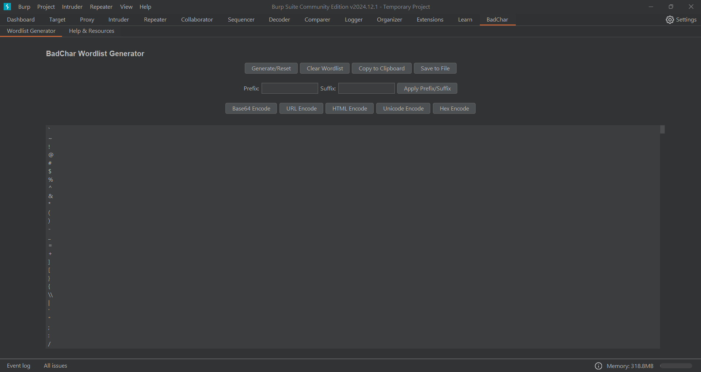
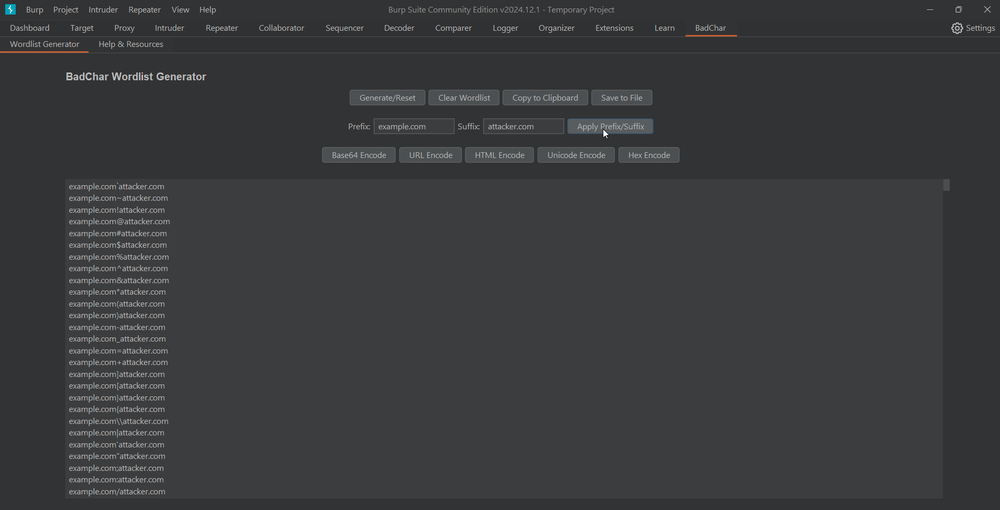
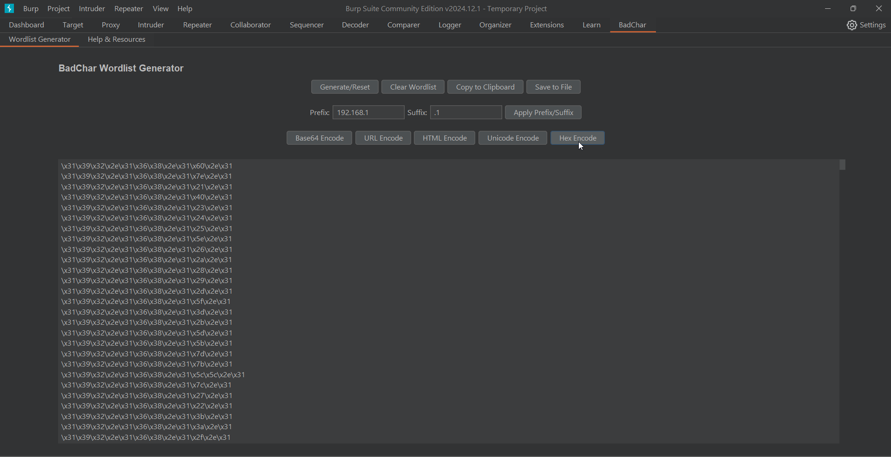

# BadChar Wordlist Generator

 

#### BadChar Wordlist Generator is a Burp Suite extension designed for creating wordlists with "bad characters" for penetration testing and bug hunting. It supports encoding options and prefix/suffix customization, or custom wordlist for generating payloads.

## Installation

1. At first need install [jython](https://www.jython.org/download)
2. Download the latest release from the [Releases Page](https://github.com/Hashtag-AMIN/BadChar/releases) or badchar.py file.
3. Open Burp Suite and go to the "Extender" tab.
4. Click "Add" and select the downloaded `.py` file.
5. The extension will appear as a new tab named "BadChar."

## Usage

### Wordlist Generator

1. Navigate to the **BadChar** tab.
2. Click "Generate Wordlist" to create a list of bad characters.
3. Add a prefix or suffix using the text fields and click "Apply Prefix/Suffix."
4. Choose an encoding method by clicking the respective button (e.g., "Base64 Encode").
5. Save the wordlist to a file or copy it to your clipboard.
6. all steps are flexible and able to choose without order
7. Click "Generate Wordlist", "Apply Prefix/Suffix" or "Clear Wordlist" for return each step

### Integration with Intruder

1. Send a request to Burp Suite Intruder.
2. In the **Payloads** menu, choose "Extension-generated."
3. Select "BadChar" as the generator.
4. Start the attack.

## Example Use Case

### Generate Wordlist

- Generate wordlists with almost all bad characters.

### Add Suffix or/and Prefix

- Add custom prefixes and suffixes to payloads.

### Encoding Features

- Apply Base64, URL, HTML, Unicode, or Hex encoding characters or payloads.

### Intruder Extension-generated API

- Directly use wordlists in Burp Suite Intruder.

### Easy save or copy clipboar

- Save wordlists to a file or copy them to your clipboard.

### Special thanks to:
- [PortSwigger Technical Support](https://portswigger.net) for continuous support.
- [PortSwigger and Burp Suite](https://github.com/portswigger) for learn many valuble things from this community.

 

Happy Hunting! 🎯

